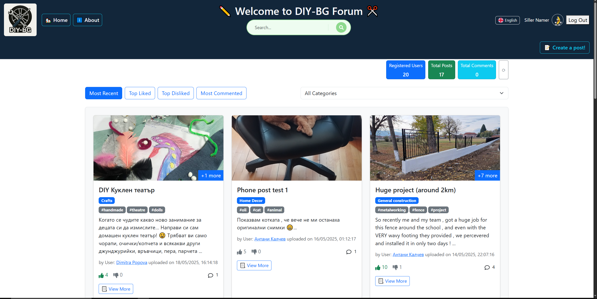
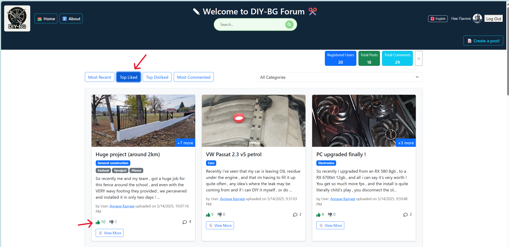
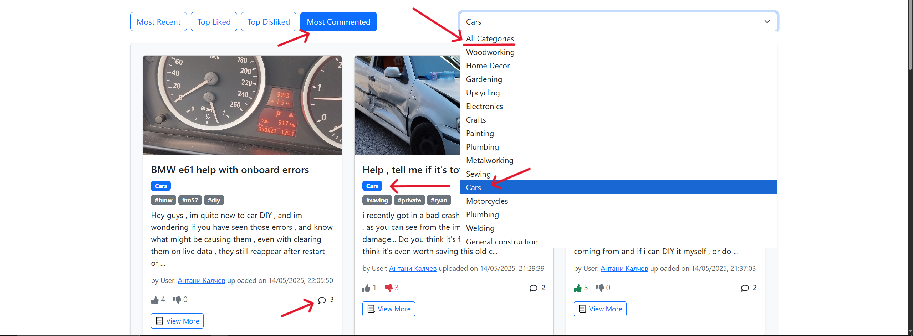
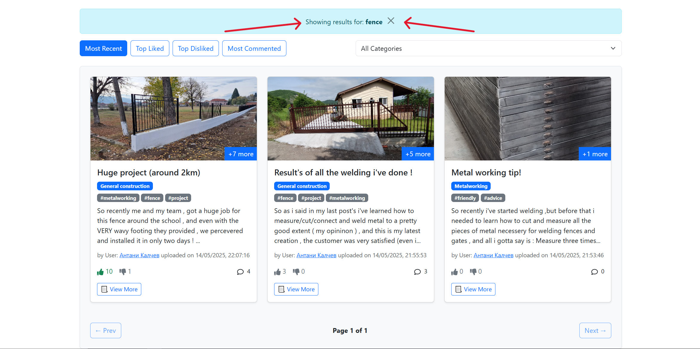
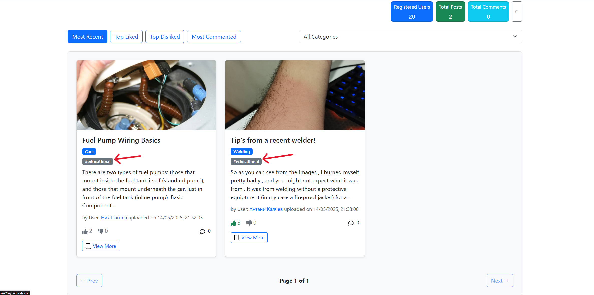
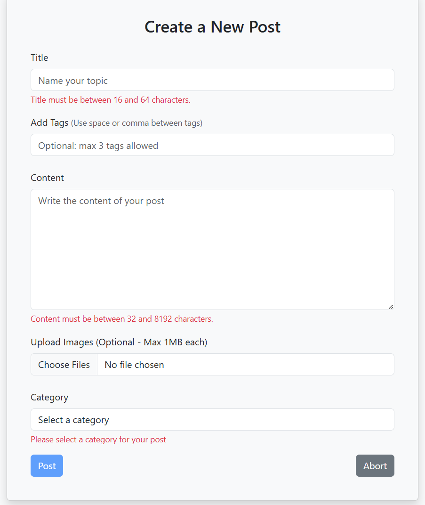
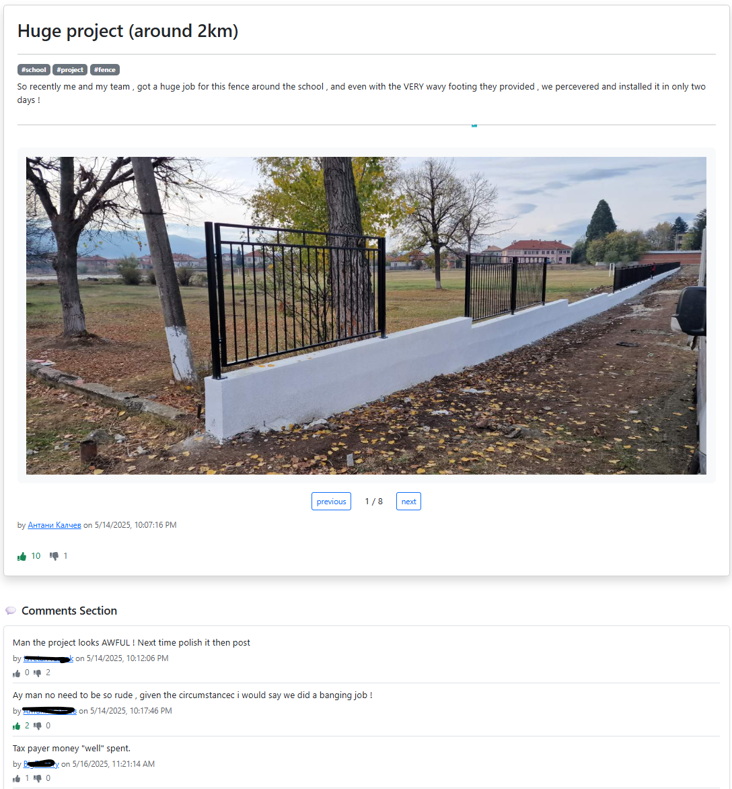
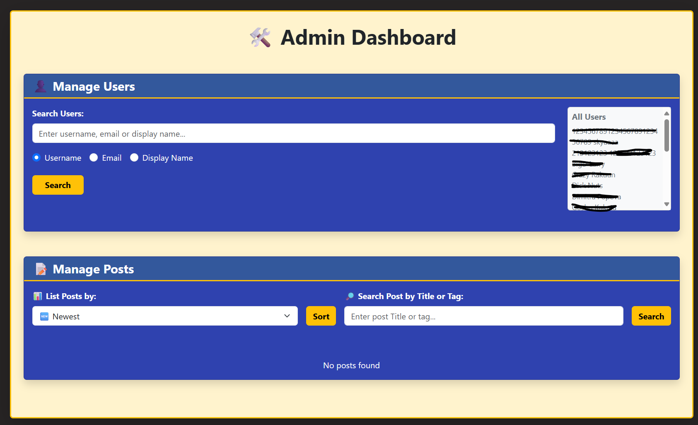

# DIY-BG Forum 🧵🇧🇬

DIY-BG is a React + TypeScript forum Single-page application built as part of a full-stack development project. It supports authenticated posting, real-time data updates with Firebase Realtime Database, and multilingual support using i18n (English & Bulgarian).

## 🌐 Tech Stack

- **Frontend:** React + TypeScript + Bootstrap + React Router
- **Backend:** Firebase Realtime Database
- **Auth:** Firebase Authentication (Google login)
- **i18n:** react-i18next for dynamic language switching
- **Deployment:** Vite

---

## 📸 Screenshots

### 🏠 Home Page with Hero and Posts

This is the home screen displaying the hero section and a list of all recent posts. Also the total registared users, posts and comments.And much more essantials are displayed like buttons to About, User profile and to create a post! 


---
Or if you like, you can also display Top Liked posts.


---
Or by category, with included sorting too!


---
Or the old fashioned way and just Search for it.


---
Or click on a Tag(yes, we have that too!) to view posts with same tags. 


### 🌍 Multilingual Support — Bulgarian

The same homepage with the language toggled to Bulgarian using the i18n toggle.


### 📝 Create Post

The authenticated user can create a new post.



### 💬 Detailed View with Comments

Clicking on a post leads to the detailed view, including nested comments.



### 🙍‍♂️ User Profile Page

Each user has a profile with an overview of their activity.


### 🔐 Admin Dashboard

Admins can manage users and posts via a protected Admin Dashboard.



---

## 📌 Features

- 🔒 Authenticated access to create and comment
- 🌍 Language toggle (English 🇺🇸 / Bulgarian 🇧🇬)
- ⚙️ Admin Dashboard for moderation
- 📖 Post detail with nested comment support
- ☁️ Firebase for real-time data & authentication

---

## 💡 About the Project

This project was built during a JavaScript and React software engineering bootcamp to demonstrate practical experience in full-stack web development. DIY-BG mimics a community forum where users can share posts and discuss ideas. It's also a playground for implementing authentication, admin control, localization, and Firebase integration.

---

## 📁 File Structure Notes

This is the **outer README.md**. All image paths here reference the project root:

```
DIY-BG/
├── public/
├── src/
│   └── assets/
│       └── readme/
│           ├── forReadme1.png
│           ├── forReadme1-1.png
│           ├── forReadme2.png
│           ├── forReadme2-1.png
│           ├── forReadme3.png
│           ├── forReadme4.png
|           ├── forReadme6_MostRecent.png
|           ├── forReadme7_Categories.png
|           ├── forReadme8_Search.png
|           └── forReadme9_SearchTags.png
└── README.md  <-- you are here
```

---

Made with 💻 by [IYI-Pantev], [antatoni], [Ph1los0phy]
