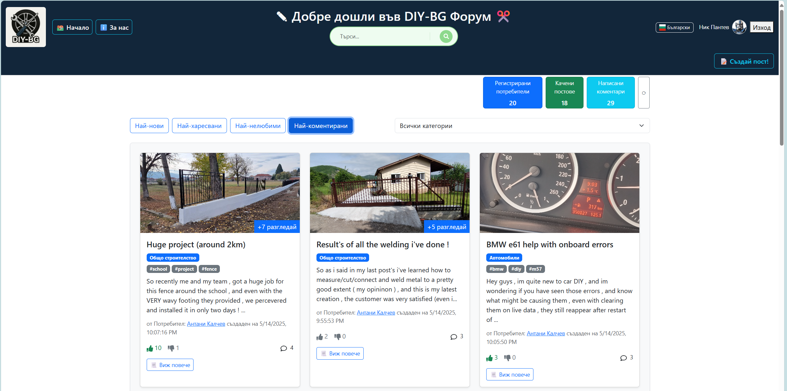
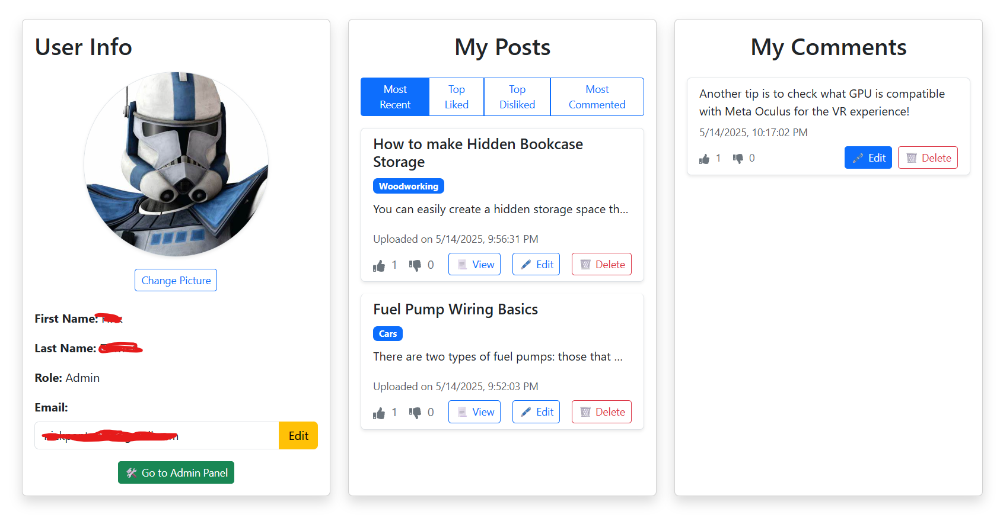

# DIY-BG Forum 🧵🇧🇬

DIY-BG is a React + TypeScript forum application built as part of a full-stack development project. It supports authenticated posting, real-time data updates with Firebase Realtime Database, and multilingual support using i18n (English & Bulgarian).

## 🌐 Tech Stack

- **Frontend:** React + TypeScript + Tailwind CSS + React Router
- **Backend:** Firebase Realtime Database
- **Auth:** Firebase Authentication (Google login)
- **i18n:** react-i18next for dynamic language switching
- **Deployment:** Vite

---

## 📸 Screenshots

### 🏠 Home Page with Hero and Posts

This is the home screen displaying the hero section and a list of posts.


### 🌍 Multilingual Support — Bulgarian

The same homepage with the language toggled to Bulgarian using the i18n toggle.



### 📝 Create Post

The authenticated user can create a new post.


### 💬 Detailed View with Comments

Clicking on a post leads to the detailed view, including nested comments.


### 🙍‍♂️ User Profile Page

Each user has a profile with an overview of their activity.



### 🔐 Admin Dashboard

Admins can manage users and posts via a protected Admin Dashboard.


---

## 📌 Features

- 🔒 Authenticated access to create and comment
- 🌍 Language toggle (English 🇺🇸 / Bulgarian 🇧🇬)
- ⚙️ Admin Dashboard for moderation
- 📖 Post detail with nested comment support
- ☁️ Firebase for real-time data & authentication

---

## 💡 About the Project

This project was built during a JavaScript and React software engineering bootcamp to demonstrate practical experience in full-stack web development. DIY-BG mimics a community forum where users can share posts and discuss ideas. It's also a playground for implementing authentication, admin control, localization, and Firebase integration.

---

## 📁 File Structure Notes

This is the **outer README.md**. All image paths here reference the project root:

```
DIY-BG/
├── public/
├── src/
│   └── assets/
│       └── readme/
│           ├── forReadme1.png
│           ├── forReadme1-1.png
│           ├── forReadme2.png
│           ├── forReadme2-1.png
│           ├── forReadme3.png
│           └── forReadme4.png
└── README.md  <-- you are here
```

---

Made with 💻 by [IYI-Pantev], [antatoni], [Ph1los0phy]
